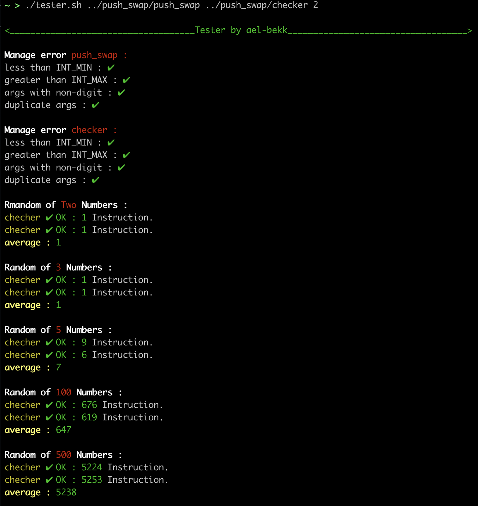

# Tester for push swap To see how it works
push swap tester for 42 push_swap project

This tester shows the performance of your push_swap program

and check that your checker works correctly.

* [How to run this tester?](#how-to-run-this-tester)

## What's push_swap_tester?

Push_swap_tester is a little tester that shows you how your push_swap works.
It displays the number of instructions performed by your push_swap in color, with the average
here is the colors means:


-  `means so good`
-  `means good`
-  `means it's ok`
-  `means bad`
-  `means realy bad`
-  `means eliminatory`



## How to run this tester?

```bash
git clone https://github.com/ael-bekk/push_swap_tester.git
cd push_swap_tester/
./tester.sh [path/push_swap] [path/checker (your checker or checker_mac)] [nb_of_tests]
```
### for example:
the following command will perform one test with a stack of 2 & 3 & 5 & 100 & 500 integers, and check error two
```bash
./tester.sh ../push_swap ../checker
```
   
the following command will perform 5 tests with a stack of 2 & 3 & 5 & 100 & 500 integers, and check error two
```bash
./tester.sh ../push_swap ../checker 5
```

## 📝 License

This project is licensed under the MIT - see the [LICENSE](LICENSE) file for details.

---
